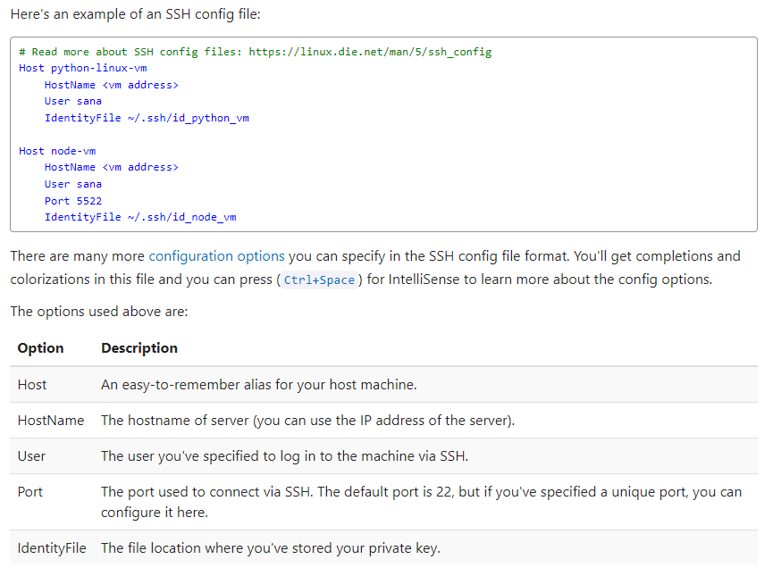

# 配置vscode ssh 服务器，并且免密登录
1. 在本地机器生成密钥对(公钥+私钥)：ssh-keygen
2. 私钥放本机，公钥放远程(~/.ssh路径下)
ssh-copy-id user@host
3. 在远程机器用公钥生成authorized_keys：
进入home目录下的.ssh文件夹：cd ~/.ssh
ssh user@host 'mkdir -p .ssh && cat >> .ssh/authorized_keys' < ~/.ssh/id_rsa.pub
cat id_rsa.pub >> authorized_keys
，如果还是不行, cat 本地的id_rsa.pub，然后复制内容到服务器的~/.ssh/authorized_keys中新增一行
4. vscode config文件加入本机私钥路径

# Waring
1. 比如有个服务器，叫10.103.49.240服务器，这个服务器重置啦。后面当我们再去ssh这个服务器的时候，需要把本机的.ssh 文件里面的 known_host 里面关于10.103.49.240相关信息删除掉，不然连接不上，cli会报错
2.尝试以上还有问题，可尝试执行如下命令
chmod 700 ./.ssh
chmod 600 ./.ssh/authorized_keys

原因是SSH不希望用户目录和~/.ssh目录对组有写权限

如果没有解决可尝试使用执行 sudo cat /var/log/secure 查看系统的安全日志，根据具体日志内容解决