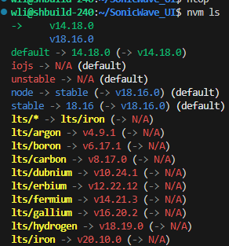
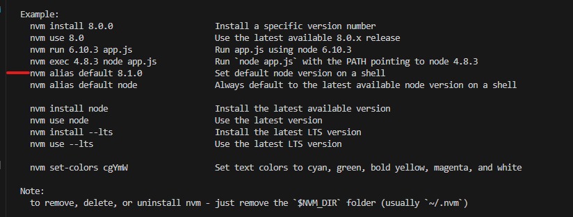

# 配置全局代理，并安装nvm
``` bash
export http_proxy='10.50.128.110:3128'

export https_proxy='10.50.128.110:3128'

curl -o- https://raw.githubusercontent.com/nvm-sh/nvm/v0.39.1/install.sh | bash
```

**nvm安装成功后，会默认安装node npm ,并把此时下载的版本设为默认版本**



**如果后面你使用 ``nvm install xxx nvm use xxx `` 当前调试控制台（Debug Console）nod版本是你刚刚nvm use使用的版本，只会在当前调试控制台环境生效，当我再打开新的调试控制台，这个新的调试控制台环境里面的node版本是 default版本的**

1. 用这个命令 `` nvm alias default xxx `` 来设置,(有的时候需要重新打开终端才会生效)，每次打开新的调试控制台的时候默认打开default版本


