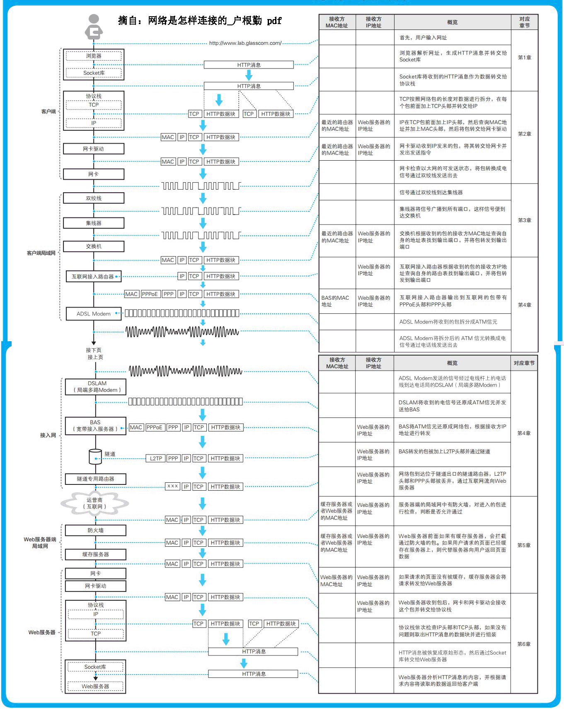

# 学习网络是怎么连接的 记录一下关键点，后面好回忆

## 第一章 浏览器生成消息——探索浏览器内部

1. 生成 HTTP 请求消息
2. 向 DNS 服务器查询 Web 服务器的 IP 地址
3. 全世界 DNS 服务器的大接力
4. 委托协议栈发送消息
    * 前三部分都是获取ip地址
    * 当ip地址知道过后，委托操作系统内部的协议栈向这个目标 IP
地址发送数字信息。本书然后介绍浏览器与 Web 服务器之间收发消息的过程
## 第二章 用电信号传输 TCP/IP 数据——探索协议栈和网卡
1. 创建套接字
2. 连接服务器
3. 收发数据
4. 从服务器断开并删除套接字
5. IP 与以太网的包收发操作
6. UDP 协议的收发操作
   * 报头和起始帧分界符 | MAC 头部 | IP 头部 | 数据 | FCS (包)
   * to do WireShark 这个工具对这一章可以实际操作一次。这样会深入理解
## 第三章 从网线到网络设备——探索集线器、交换机和路由器
1. 信号在网线和集线器中传输
   * 集线器将信号发送给所有连接在它上面的线路
2. 交换机的包转发操作
    * 交换机根据（MAC 地址表： mac address, port, 控制信息）地址表查找MAC地址，然后将信号发送到相应的端口(交换电路将包发送到相应的端口，交换电路是交换机的原型，“交换机”这个词也是从交换电路来的)
    * 全双工模式可以同时进行发送和接收，自动协商：确定最优的传输速率
3. 路由器的包转发操作
    * 查询路由表确定输出端口，路由器的各个端口都具有 MAC 地址和 IP 地址
    路由器判断下一个转发目标的方法如下。
    * 如果路由表的网关列内容为 IP 地址，则该地址就是下一个转发目标。
    * 如果路由表的网关列内容为空，则 IP 头部中的接收方 IP 地址就是下一个转发目标。路由器也会使用 ARP 来查询下一个转发目标的 MAC 地址
4. 路由器的附加功能
    * 通过地址转换有效利用 IP 地址
    * 路由器的包过滤功能
## 第四章 通过接入网进入互联网内部——探索接入网和网络运营商
1. ADSL 接入网的结构和工作方式
    * ADSL： Asymmetric Digital Subscriber Line，不对称数字用户线。它是一种利用架设在电线杆上的金属电话线来进行高速通信的技术，它的上行方向（用户到互联网）和下行方向（互联网到用户）的通信速率是不对称的。
    * 不断改变形态的网络包 ：互联网接入路由器会在网络包前面加上 MAC 头部、PPPoE 头部、PPP 头 部 总共 3 种 头 部， 然 后 发 送 给 ADSL Modem -> ADSL Modem 将包拆分成信元，并转换成电信号发送给分离器(ADSL Modem 采用了一种用圆滑波形（正弦波）对信号进行合成来表示 0 和 1 的技术，这种技术称为调制->ADSL 将信元“调制”成信号)-> 信号通过电话线到达电话局之后，会经过配线盘、分离器到达 DSLAMA -> DSLAM 具有 ATM 接口，和后方路由器收发数据时使用的是原始网络包拆分后的 ATM 信元形式-> BAS 负责将 ATM 信元还原成网络包并转发到互联网内部。
    * ADSL 就是在包上加头，根据电信号波形式传播
2. 光纤接入网（FTTH）
    * 由互联网接入路由器在 IP 头部前面加上 MAC 头部、PPPoE 头部和 PPP 头部，然后由光纤收发器或者 ONU 转换成光信号 D，通过光纤到达 BAS 前面的多路光纤收发器和 OLT，最后被还原成电信号并到达 BAS。
    * 光纤是通过光传播
3. 接入网中使用的 PPP 和隧道
4. 网络运营商的内部
    * 运营商网络也是以路由器为核心组成的, 如运营商之间可以自动交换路由信息和更新路由表
5. 跨越运营商的网络包
    * 运营商之间可以直接连接，也可以通过 IX 连接，最终网络包都会到达服务器所在的运营商，然后通过 POP（ADSL、FTTH 等接入网是与用户签约的运营商设备相连的，这些设备称为 POPB，互联网的入口就位于这里） 进入服务器端的网络
    * 网络包是如何通过互联网接入路由器，最终进入互联网内部的
## 第五章 服务器端的局域网中有什么玄机
1. Web 服务器的部署地点
    * 在公司里部署 Web 服务器
    * 把服务器放在网络运营商等管理的数据中心里，或者直接租用运营商提供的服务器。
2. 防火墙的结构和原理 
    * 　防火墙可分为包过滤、应用层网关、电路层网关等几种方式
    *   主流的包过滤方式：包过滤方式的防火墙可根据接收方 IP 地址、发送方 IP 地址、接收方端口号、发送方端口号、控制位等信息来判断是否允许某个包通过
3. 通过将请求平均分配给多台服务器来平衡负载
    * 性能不足时需要负载均衡,使用负载均衡器分配访问
4. 利用缓存服务器分担负载 
    * 缓存服务器通过更新时间管理内容
    * 正向代理,反向代理，透明代理
5. 内容分发服务
    * 利用内容分发服务分担负载， 一些专门从事相关服务的厂商出现了，他们来部署缓存服务器，并租借给 Web 服务器运营者。这种服务称为内容分发服务
    * 　如何找到最近的缓存服务器：方法挺多，其一：DNS 服务器返回 Web 服务器 IP 地址时，对返回的内容进行一些加工，使其能够返回距离客户端最近的缓存服务器的 IP 地址
    *   通过重定向服务器分配访问目标： 通过路由信息判断，通过网络包往返时间估算到缓存服务器的距离
    * 这章学习的重点，firewall基础知识，和一些基本功能作用
## 第六章  请求到达 Web 服务器，响应返回浏览器——短短几秒的“漫长旅程”迎来终点
    1. 服务器概览
    2. 服务器的接收操作
    3. Web 服务器程序解释请求消息并作出响应
    4. 浏览器接收响应消息并显示内容
  