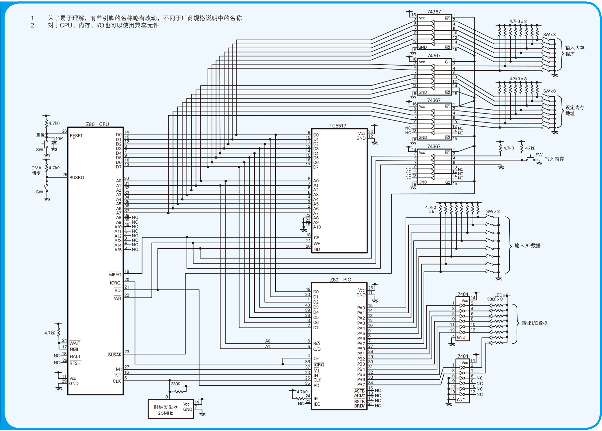

# 计算机是怎样跑起来的--快速学习计算机组成的一些知识，然后细读下一本书：编码

## 1. 计算机三大原则

- 计算机是执行输入、运算、输出的机器
- 程序是指令和数据的集合
- 计算机的处理方式有时与人们的思维习惯不同

## 2. 试着制造一台计算机吧

- Hz 是表示什么的单位?
  - 通常用 Hz 来表示驱动 CPU 运转的时钟信号的频率。1秒发出 1 次时钟信号就是 1Hz，所以 100MHz（兆赫兹）的话就是 100×100 万 = 1 亿次／秒。M（兆）代表100 万
- Z80 CPU 是多少比特的 CPU ?
  - CPU 上数据总线的条数，或者 CPU 内部参与运算的寄存器的容量，都可以作为衡量CPU 性能的比特数。在Z80 CPU 中，无论是数据总线的条数还是寄存器的容量都是 8 比特，所以 Z80 CPU 是一款 8 比特的 CPU。而在 Windows 个人计算机中广泛使用的 Pentium（奔腾）CPU 则是 32 比特的 CPU。
- 这一章讲解怎么组成一个微型计算机，很粗略的讲解计算的组成，主要的cpu,i/o,存储，可以看看这个图片，了解计算机的电路图

